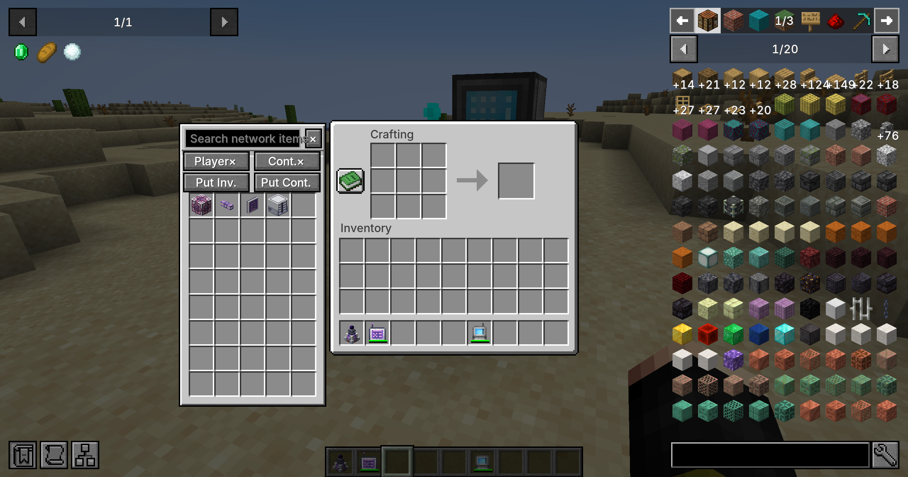

# Better AE2

Adds a searchable AE2 network sidebar to container screens while carrying a usable wireless terminal.

Inspired by [Better Beyond Dimensions](https://www.curseforge.com/minecraft/mc-mods/better-beyond-dimensions), adapted to Applied Energistics 2 wireless terminals and ME storage.



## Features

- Browse and search network items without leaving your inventory or container screen.
- Withdraw items, deposit held items, and quickly move stacks into your ME network.
- Separate player and container Shift-click toggles, plus one-click inventory/container deposits.
- Inventory deposits skip the hotbar. Wireless terminals are protected from being deposited into the network.
- The sidebar requires a linked, usable terminal and respects AE2's own access, range, network, and power checks. Picking up the terminal hides it; putting the terminal back restores it without reopening the screen.
- Carry the terminal in your inventory, or equip it in a Curios slot when Curios is installed. **Curios is optional.**
- Vanilla-style slots, configurable sidebar placement and visibility, and optional JEI recipe integration.
- Storage operations are executed and checked on the server.

## Installation

Install Better AE2 and Applied Energistics 2 on **both the client and server**. Choose the file matching your Minecraft version and loader.

| Minecraft | Loader | Required AE2 | Optional Curios |
| --- | --- | --- | --- |
| 1.20.1 | Forge | 15.4+ | 5.9+ |
| 1.21.1 | NeoForge | 19.2+ | 9.2+ |

JEI is optional. This is an independent AE2 addon, not an official AE2 release.

## Controls and settings

Use the sidebar buttons to enable player/container Shift-click routing or deposit items.
The container-deposit shortcut defaults to **Z**. Inventory deposit is **unbound** by default; configure both under Minecraft's Controls menu.

Client settings are saved to `config/better_ae2-settings.json`.
Set `disableConflictingKeys` to `true` to cancel competing key events when using deposit shortcuts (default: `false`).

## Build

The two loader projects are maintained in separate folders:

- `forge/`: Java 17, Forge 47.4.23, AE2 15.4.10.
- `neoforge/`: Java 21, NeoForge 21.1.233, AE2 19.2.17.

```powershell
cd forge
.\gradlew.bat build

cd ..\neoforge
.\gradlew.bat build
```

Artifacts are written to each project's `build/libs/` directory. Gradle resolves dependencies; third-party mod jars and development saves are not included in this repository.

## 中文说明

在背包、工作台等容器界面旁显示 AE2 网络物品侧边栏，可搜索、取出、存入和一键存背包/容器。
只有身上存在已链接且可用的无线终端时才生效；终端拿起后隐藏，放回后自动恢复。
支持普通背包和可选 Curios 饰品栏。存背包不处理快捷栏，各种网络存入操作都会保护无线终端本身。
客户端与服务端都需要安装 Better AE2 和 AE2，Curios 与 JEI 均为可选。

## License

[MIT](LICENSE). Applied Energistics 2, Curios, JEI, and Minecraft remain the property of their respective authors.
